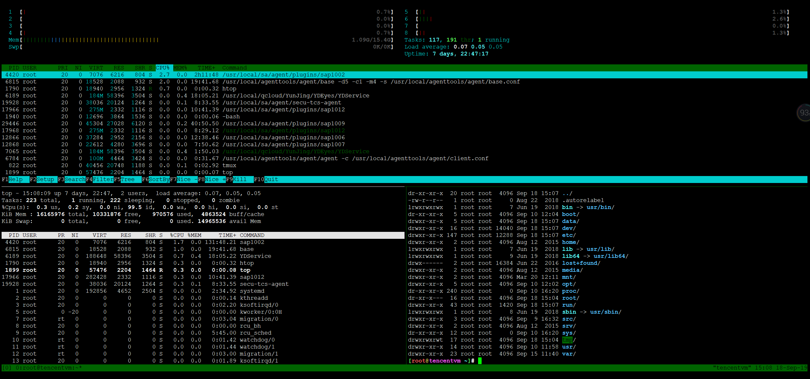

# tmux

## 简介

tmux 是一款终端复用命令行工具，一般用于 Terminal 的窗口管理。而在 macOS 下，使用 iTerm2 能应付绝大多数窗口管理的需求。

## 目录

* [读我](README.md)
* [安装](docs/安装.md)
* [基本概念](docs/基本概念.md)
* [基本操作](docs/基本操作.md)
* [session会话操作](docs/session会话操作.md)
* [window窗口操作](docs/window窗口操作.md)
* [pane窗格操作](docs/pane窗格操作.md)

## 参考

* [awesome-cheatsheets]: <https://github.com/skywind3000/awesome-cheatsheets/blob/master/tools/tmux.txt>

---
