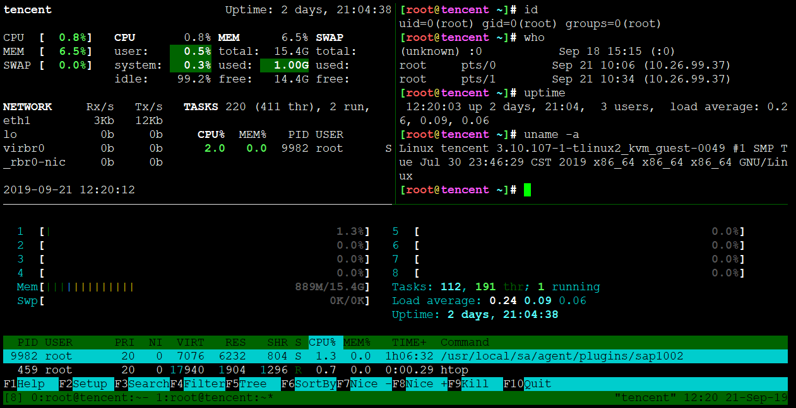
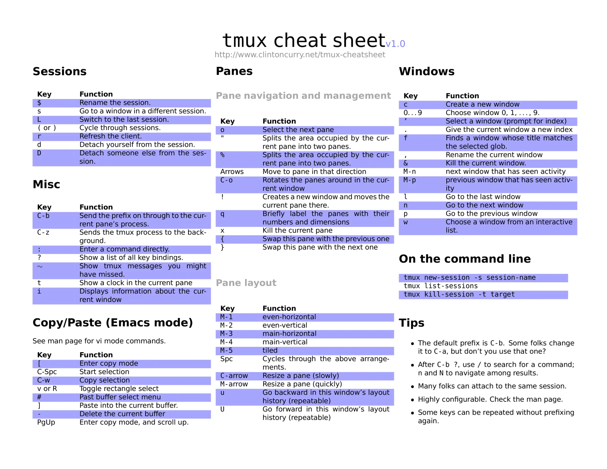

# tmux


## 本仓库内容

1. tmux基本功学习笔记

**tmux 是一款终端复用命令行工具，一般用于 Terminal 的窗口管理。而在 macOS 下，使用 iTerm2 能应付绝大多数窗口管理的需求。**

```
Something I hope you know before go into the coding~
First, please watch or star this repo, I'll be more happy if you follow me.
Bug report, questions and discussion are welcome, you can post an issue or pull a request.
```

## 相关站点

* GitBook:<https://yifengyou.gitbooks.io/learn-tmux/content/>
* GitHub:<https://github.com/yifengyou/learn-tmux/>
* GitPage:<https://yifengyou.github.io/learn-tmux/>

## 目录

* [安装](docs/安装.md)
* [基本概念](docs/基本概念.md)
* [基本操作](docs/基本操作.md)
* [session会话操作](docs/session会话操作.md)
    * [创建会话](docs/session会话操作/创建会话.md)
    * [重连会话](docs/session会话操作/重连会话.md)
    * [杀死会话](docs/session会话操作/杀死会话.md)
* [window窗口操作](docs/window窗口操作.md)
    * [创建窗口](docs/window窗口操作/创建窗口.md)
    * [罗列及切换窗口](docs/window窗口操作/罗列及切换窗口.md)
    * [关闭窗口](docs/window窗口操作/关闭窗口.md)
    * [命名窗口](docs/window窗口操作/命名窗口.md)
* [pane窗格操作](docs/pane窗格操作.md)
    * [创建窗格](docs/pane窗格操作/创建窗格.md)
    * [切换窗格](docs/pane窗格操作/切换窗格.md)
    * [调整窗格](docs/pane窗格操作/调整窗格.md)
    * [关闭窗格](docs/pane窗格操作/关闭窗格.md)
    * [pane同步](docs/pane窗格操作/pane同步.md)
* [其他操作](docs/其他操作.md)
    * [显示时钟](docs/其他操作/显示时钟.md)
    * [命令行](docs/其他操作/命令行.md)
    * [帮助信息](docs/其他操作/帮助信息.md)
* [.tmux.conf配置](docs/tmuxconf配置.md)


## 效果图



## 快捷键



## 参考

* awesome-cheatsheets : <https://github.com/skywind3000/awesome-cheatsheets/blob/master/tools/tmux.txt>

## 优缺点

* 优点

1. 功能强劲
2. 简洁
3. 高效
4. 灵活可配置


* 缺点

1. 不支持lrzsz，至少原生不支持，怎么破？
2. 对vim显示有影响，怎么配置？


---
