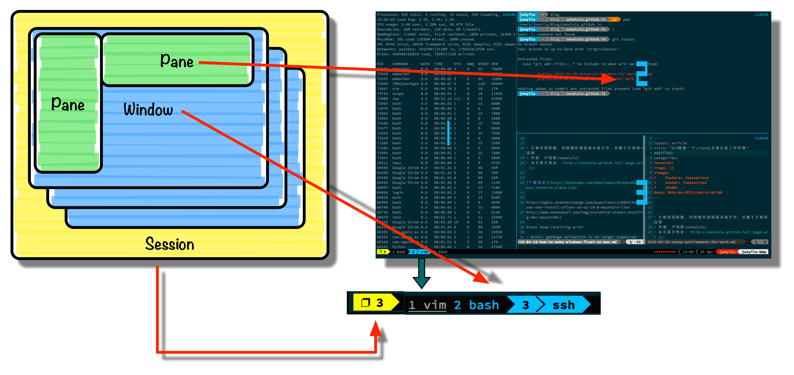
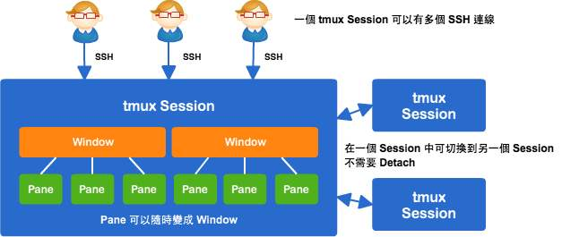
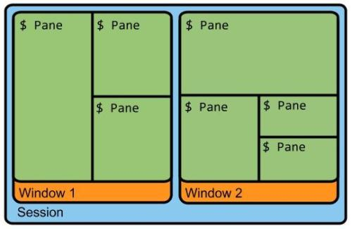
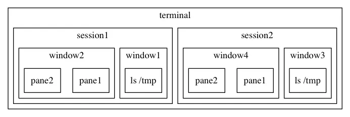
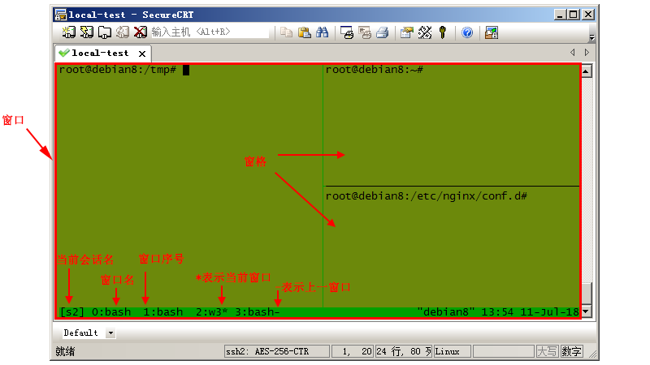

# 基本概念

## 前缀快捷键

**tmux 中所有的快捷键都需要和前缀快捷键 ctrl + b  来组合使用**

* tmux环境下，左右快捷键都必须经过前缀快捷键发起，也就是说任意快捷键至少3个按键触发

## session

* 每次下tmux指令时都会开启一个新的会话，会话各自独立。
* session包括window，window包括pane，层层嵌套
* 如何创建session？
* 如何删除session？
* session标记是什么？
* session之间如何切换？

## window窗口

* window就是整个终端机画面，一个会话里面可以有多个窗口
* 如何创建窗口？
* 如何删除窗口？
* 如何标记窗口？
* 窗口之间如何切换？

## pane窗格

* 一个窗口可以切成多个小区块，每个区块就是一个窗格，通常会用来同时观察多个程式
* 如何创建窗格？
* 如何删除窗格？
* 窗格之间如何切换？
