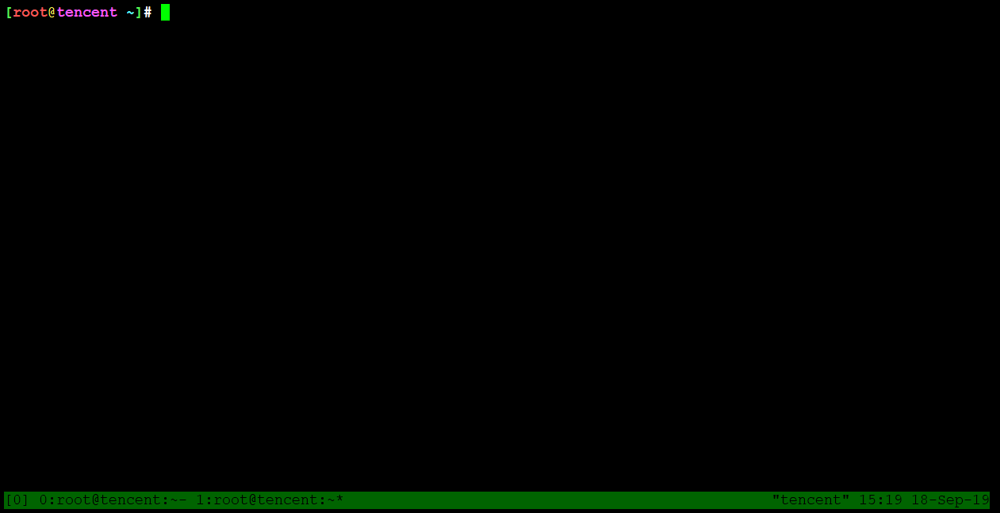
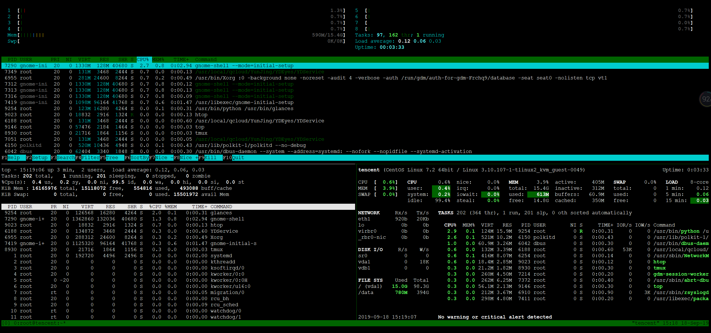

# 安装

## Debian / Ubuntu
```
sudo apt-get install tmux
```
## RedHat / CentOS

```
[root@Tencent ~]# yum install tmux -y
Loaded plugins: fastestmirror, langpacks
base                                                                                      | 3.6 kB  00:00:00     
epel                                                                                      | 5.4 kB  00:00:00     
extras                                                                                    | 3.4 kB  00:00:00     
tlinux                                                                                    | 3.6 kB  00:00:00     
tlinux-kvm-guest                                                                          | 3.6 kB  00:00:00     
updates                                                                                   | 3.4 kB  00:00:00     
(1/3): epel/x86_64/updateinfo                                                             | 1.0 MB  00:00:00     
(2/3): tlinux/2.2/x86_64/primary_db                                                       | 2.9 MB  00:00:00     
(3/3): epel/x86_64/primary_db                                                             | 6.8 MB  00:00:00     
Loading mirror speeds from cached hostfile
Resolving Dependencies
--> Running transaction check
---> Package tmux.x86_64 0:1.8-4.el7 will be installed
--> Finished Dependency Resolution

Dependencies Resolved

=================================================================================================================
 Package                 Arch                      Version                         Repository               Size
=================================================================================================================
Installing:
 tmux                    x86_64                    1.8-4.el7                       base                    243 k

Transaction Summary
=================================================================================================================
Install  1 Package

Total download size: 243 k
Installed size: 558 k
Downloading packages:
tmux-1.8-4.el7.x86_64.rpm                                                                 | 243 kB  00:00:00     
Running transaction check
Running transaction test
Transaction test succeeded
Running transaction
  Installing : tmux-1.8-4.el7.x86_64                                                                         1/1
  Verifying  : tmux-1.8-4.el7.x86_64                                                                         1/1

Installed:
  tmux.x86_64 0:1.8-4.el7                                                                                        

Complete!

```




安裝完跑 tmux，下方绿色条状，表示已经进入tmux环境。然后浪起来，搞事情搞事情。


